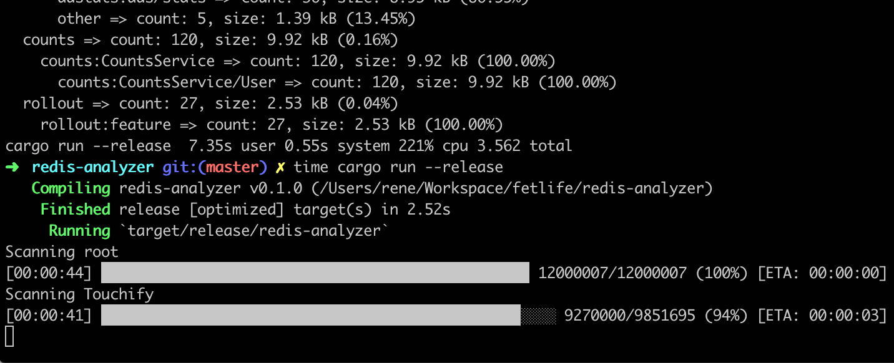

# Memory Analyzer

## Usage

```
# redis-analyzer --help

redis-analyzer 0.1.0
Analyzes keys in Redis to produce breakdown of the most frequent prefixes.

USAGE:
    redis-analyzer [FLAGS] [OPTIONS] --urls <URLS>

FLAGS:
    -h, --help        Prints help information
        --progress    Shows progress
    -V, --version     Prints version information

OPTIONS:
        --format <plain|json>                                       Output format (default: plain)
    -d, --max-depth <MAX_DEPTH>                                     Maximum key depth to examine (default: not limited)
    -p, --max-parallelism <MAX_PARALLELISM>
            Maximum number of hosts scanned at the same time (default: number of logical CPUs)

    -f, --min-prefix-frequency <MIN_PREFIX_FREQUENCY_PERCENTAGE>
            Minimum prefix frequency in percentages for prefix to be included in the result (default: 1)

    -s, --separators <SEPARATORS>                                   List of key separators (default: ":/|" )
        --sort <count|memory>                                       Sort order (defalt: memory)
    -u, --urls <URLS>                                               List of URLs to scan
```

## Preview


Example output:

```
                             Key Count                               Memory Usage
ALL -------------------------- 15155 (100.00%)------------------------ 26.88MB (100.00%)
 ├─ cache ---------------------├─ 294 (1.94%)--------------------------├─ 2.04MB (7.60%)
 │   └─ Touchify --------------│---└─ 239 (81.29%)---------------------│---└─ 20.62KB (0.99%)
 │      └─ internal -----------│------└─ 239 (100.00%)-----------------│------└─ 20.62KB (100.00%)
 │         └─ User ------------│---------└─ 239 (100.00%)--------------│---------└─ 20.62KB (100.00%)
 ├─ feed ----------------------├─ 158 (1.04%)--------------------------├─ 1.60MB (5.97%)
 │   └─ feed ------------------│---└─ 158 (100.00%)--------------------│---└─ 1.60MB (100.00%)
 │      └─ feeds --------------│------└─ 155 (98.10%)------------------│------└─ 1.60MB (99.93%)
 ├─ hovno ---------------------├─ 13808 (91.11%)-----------------------├─ 1.55MB (5.75%)
 ├─ sidekiq -------------------├─ 399 (2.63%)--------------------------├─ 1.27MB (4.74%)
 │   └─ stat ------------------│---└─ 388 (97.24%)---------------------│---└─ 28.21KB (2.16%)
 │      ├─ processed ----------│------├─ 194 (50.00%)------------------│------├─ 14.58KB (51.68%)
 │      └─ failed -------------│------└─ 194 (50.00%)------------------│------└─ 13.63KB (48.32%)
 ├─ stat ----------------------├─ 176 (1.16%)--------------------------├─ 11.24KB (0.04%)
 ├─ counts --------------------├─ 120 (0.79%)--------------------------├─ 9.68KB (0.04%)
 └─ [other] -------------------└─ 200 (1.32%)--------------------------└─ 20.39MB (75.86%)
```

Progress preview:

